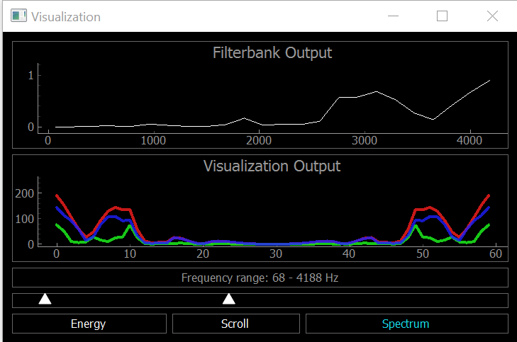

All credits to https://github.com/scottlawsonbc/audio-reactive-led-strip , I found raspberry pi installation process to be a bit cumbersome, as well as while debugging, found codes of ESP8266 and blinkstick, which were not useful. 
So just removed those codes, added small modifications.

# Audio Reactive LED Strip
Real-time LED strip music visualization using Python and the  Raspberry Pi.

# Overview
The repository includes everything needed to build an LED strip music visualizer (excluding hardware):

- Python visualization code, which includes code for:
  - Recording audio with a microphone ([microphone.py](python/microphone.py))
  - Digital signal processing ([dsp.py](python/dsp.py))
  - Constructing 1D visualizations ([visualization.py](python/visualization.py))
  - Sending pixel information to the ESP8266 over WiFi ([led.py](python/led.py))
  - Configuration and settings ([config.py](python/config.py))


# What do I need to make one?

## Standalone Raspberry Pi
You can also build a standalone visualizer using a Raspberry Pi. For this you will need: 
- Raspberry Pi (1, 2, or 3)
- USB audio input device. This could be a USB microphone or a sound card. You just need to find some way of giving the Raspberry Pi audio input.
- WS2812B LED strip (such as Adafruit Neopixels)
- 5V power supply
- 3.3V-5V level shifter (optional)

## Hardware Connections

### Raspberry Pi

Although a logic level converter is the best practice, sometimes it will still work if you simply connect the LED strip directly to the Raspberry Pi.

The connections are:

* Connect GND on the power supply to GND on the LED strip and GND on the Raspberry Pi (they MUST share a common GND connection)
* Connect +5V on the power supply to +5V on the LED strip
* Connect a PWM GPIO pin on the Raspberry Pi to the data pin on the LED strip. If using the Raspberry Pi 2 or 3, then try Pin 18.

# Installation for Raspberry Pi

## Installing the Python dependencies
Install python dependencies using apt-get
```
sudo apt-get update
sudo apt-get install python-numpy python-scipy python-pyaudio python-pyqtgraph
```

## Install ws281x library
```
pip install rpi_ws281x
```
## Audio device configuration
For the Raspberry Pi, a USB audio device needs to be configured as the default audio device.

Connect USB audio input device.

Check if it has been detected by raspbian using

```
arecord -l
```
You might want to increase gain by using ```alsamixer``` in terminal.

Create/edit `~/.asoundrc`
```
sudo nano ~/.asoundrc
```
Set the file to the following text
```
pcm.!default {
  type asym
   playback.pcm {
     type plug
     slave.pcm "hw:0,0"
   }
   capture.pcm {
     type plug
     slave.pcm "hw:1,0"
   }
}

```


## Test the LED strip
Get the file: https://github.com/pimoroni/rpi_ws281x-python/blob/master/examples/strandtest.py
Run it using 
```
sudo python strandtest.py
```

## Get visualization code

Now we need to clone this repo

```
git clone https://github.com/singhkpratham/pi-audio-reactive-led-strip.git
cd pi-audio-reactive-led-strip
```

## Configure the visualization code
In `config.py`, configure the GPIO, LED and other hardware settings.
If you are using an inverting logic level converter, set `LED_INVERT = True` in `config.py`. Set `LED_INVERT = False` if you are not using an inverting logic level converter (i.e. connecting LED strip directly to GPIO pin).

Test once:
```
sudo python led.py
```

## Run visualization
```
sudo python visualization.py scroll/spectrum/energy
```

# Running the Visualization
Once everything has been configured, run [visualization.py](python/visualization.py) to start the visualization. The visualization will automatically use your default recording device (microphone) as the audio input.

A PyQtGraph GUI will open to display the output of the visualization on the computer. There is a setting to enable/disable the GUI display in [config.py](python/config.py)



If you encounter any issues or have questions about this project, feel free to [open a new issue](https://github.com/scottlawsonbc/audio-reactive-led-strip/issues).

# License
This project was developed by Scott Lawson and is released under the MIT License.
